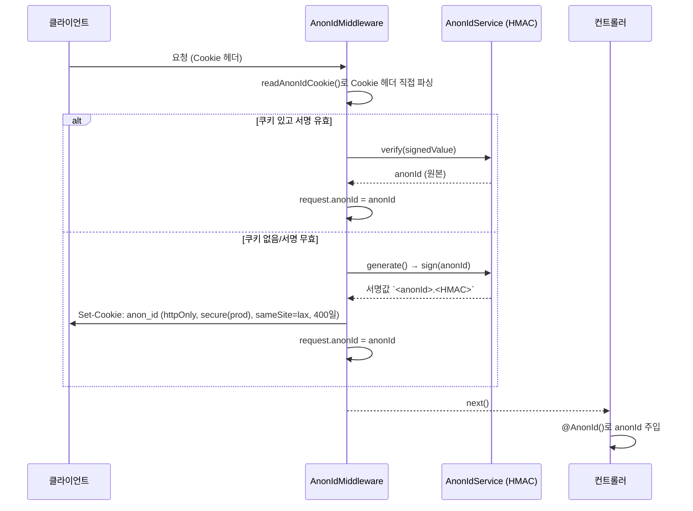
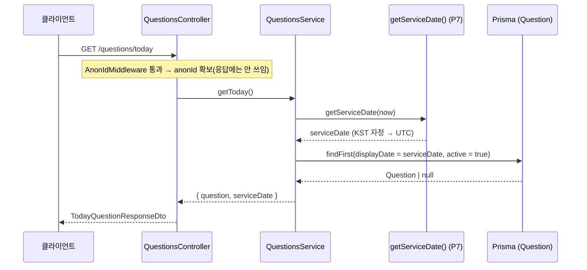
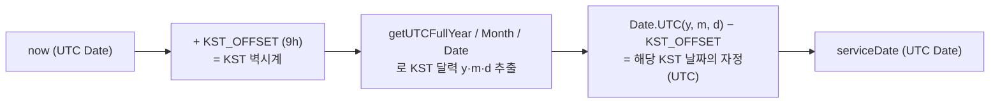
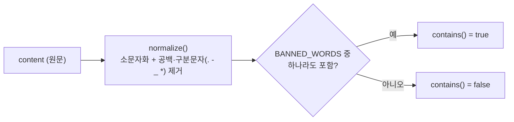

# 하루 하나 (haru-hana) — 백엔드

매일 질문 1개에 답하고 감성 카드를 만드는 **무로그인·익명** 서비스의 백엔드.
개발 규칙은 [`.claude/CLAUDE.md`](.claude/CLAUDE.md), 기획은 `docs/PRD_데일리카드.md`(정책 번호 P1~P7)를 따른다.

- **스택**: NestJS 11 · TypeScript · Prisma + PostgreSQL · Jest
- **배포**: Vercel 서버리스 함수 + Neon(pooled Postgres)

## 실행

```bash
npm install

# 로컬 개발 (src/main.ts, app.listen)
npm run start:dev

# 테스트
npm run test        # 단위
npm run test:e2e    # e2e
npm run test:cov    # 커버리지
```

- 로컬 개발: `src/main.ts` — 포트를 열고 Swagger 문서(`/api`)를 제공한다.
- 서버리스 배포: `api/index.ts` — 포트를 열지 않고 `app.init()`한 Express 인스턴스를 함수 핸들러로 노출한다(Swagger 제외).
- 두 진입점의 미들웨어·파이프(Helmet · CORS · ValidationPipe) 설정은 항상 동일하게 유지한다.

---

## 아키텍처 개요

```
api/index.ts        # 서버리스 진입점 (Vercel)
src/
├─ main.ts          # 로컬 진입점 (Helmet · CORS · ValidationPipe · Swagger)
├─ app.module.ts    # 루트 모듈 (+ AnonIdMiddleware를 전 경로에 등록)
├─ config/          # env.validation.ts (Zod, fail-fast)
├─ common/
│  ├─ prisma/       # PrismaService (전역)
│  ├─ identity/     # 익명 식별자 (P2)
│  ├─ date/         # serviceDate 유틸 (P7)
│  └─ moderation/   # 금칙어 필터 (P6)
└─ modules/
   ├─ questions/    # 오늘의 질문 (P3)
   └─ answers/      # 답변 제출·조회, 타인 답변 (P1 · P4 · P5 · P6)
prisma/schema.prisma  # Question · Answer · OtherAnswerPick 모델
```

구현 현황: **P0~P1 범위가 모두 구현됨** — questions · answers 모듈과 공통(identity/date/moderation).

---

## 도메인별 흐름도

### 1. 익명 식별자 — P2 (`common/identity`)

로그인이 없으므로 **서명된 httpOnly 쿠키 하나**로 사용자를 식별한다. `AnonIdMiddleware`가 **전 경로에서** 요청마다 실행되어 `request.anonId`를 보장하고, 컨트롤러는 `@AnonId()` 데코레이터로 그 값을 받는다.

서명/검증은 `AnonIdService`가 `COOKIE_SECRET` 기반 **HMAC-SHA256**으로 직접 처리한다(cookie-parser 비의존 → 로컬·서버리스 동일 동작).



- 쿠키 값 형식: `<anonId>.<base64url HMAC>`. 검증은 `timingSafeEqual`로 타이밍 공격을 방지한다.
- **DB를 건드리지 않는다.** 무상태라 신원 발급에 드는 DB 왕복이 0건이다.
- **가드가 아니라 미들웨어인 이유**: 가드는 라우트 선택적이라 어디에 붙일지를 매번 판단해야 하고, 그 누락이 곧 신원 유실이 된다. 실제로 부팅 시 `/questions/today`와 `/answers/me`가 쿠키 없이 병렬로 나가 anonId가 두 개 발급되고, 브라우저가 버린 쪽이 고아 `User` 행으로 쌓이던 일이 있었다. 전 경로 미들웨어로 옮기면서 그 판단 자체가 사라졌다.
- 등록은 `AppModule.configure()`에서 한다. `app.use()`를 쓰지 않는다 — 진입점이 `main.ts`·`api/index.ts` 둘이라 한쪽만 고치면 조용히 어긋난다.
- 리텐션 지표(D1/D7)는 **GA4**가 맡는다. 예전에는 여기서 `User`를 upsert했으나 테이블째 폐기됐다.

### 2. 오늘의 질문 — P3 (`modules/questions`)

`GET /questions/today`는 **오늘의 질문 + serviceDate** 두 가지만 내려준다. 응답 자체는 사용자와 무관하지만, 앱 진입 시 첫 요청이라 여기서 익명 식별자 쿠키가 발급된다(미들웨어가 전 경로에 걸려 있다).



응답 DTO (`TodayQuestionResponseDto`):

| 필드 | 설명 |
|---|---|
| `question` | 오늘 매칭 질문 `{ id, body }`. 운영자 미등록일이면 `null` |
| `serviceDate` | KST 자정 기준 서비스 날짜 (UTC ISO-8601) |

- 질문은 순환 로직이 아니라 `displayDate`(serviceDate 매칭 키)로 **DB에서 조회**한다.
- **"오늘 답변했는지"는 여기 없다.** `GET /answers/me`가 그 사실의 단일 진실이다 — 클라이언트는 카드 복원 때문에 어차피 답변 본문이 필요해 그쪽을 써야 하므로, 같은 사실의 출처를 둘로 두지 않는다.
- 부팅 경로의 DB 왕복은 1건(`Question` 조회)이다. `Answer` 테이블은 조회하지 않는다.

### 3. 서비스 날짜 — P7 (`common/date/service-date.util`)

하루 1회 판정(P1)·질문 전환(P3)의 일관성을 위해, "서비스 날짜"는 사용자 로컬 시간과 무관하게 **KST(UTC+9) 자정**을 기준으로 계산한다. 모든 도메인은 이 단일 함수(`getServiceDate`)만 사용한다.



- 예) KST 2026-06-19 00:00 → 반환 `UTC 2026-06-18 15:00`. DB에는 UTC로 저장되며 `Question.displayDate` 매칭 키로 쓰인다.
- Vercel 함수는 UTC로 실행되므로 로컬 타임존 게터(`getHours`/`getFullYear` 등)를 쓰지 않고 `getUTC*`·`Date.UTC`만 사용한다(진입점·런타임 무관 불변식).

### 4. 금칙어 필터 — P6 (`common/moderation/profanity.service`)

답변 제출 시 서버에서 콘텐츠를 검사해 어뷰징·유해물을 차단하기 위한 공용 서비스. **"검사"만 책임진다** — 차단 시 어떤 HTTP 응답을 줄지는 호출하는 도메인 서비스(answers, Phase 3)가 결정한다.



- 정규화로 `ㅅ ㅂ`, `f.u.c.k` 류의 단순 우회를 완화한다. 금칙어 목록은 최소 기본값이며 운영 중 보강한다.
- `POST /answers` 제출 흐름에서 호출되며, 걸리면 `AnswersService`가 400으로 변환한다.

---

## 데이터 모델 (`prisma/schema.prisma`)

| 모델 | 용도 | 핵심 필드 |
|---|---|---|
| `Question` | 오늘의 질문 (P3) | `body` · `displayDate`(@unique, serviceDate 매칭 키) · `active` |
| `Answer` | 답변 (P1 · P4) | `anonId` · `questionId` · `content` · `bgType`/`bgValue` · `serviceDate`<br/>`@@unique([anonId, serviceDate])`로 하루 1회를 DB가 강제 |
| `OtherAnswerPick` | 타인 답변 배정 (P5) | `anonId` · `questionId` · `answerId`<br/>`@@unique([anonId, questionId])`로 고정 노출을 DB가 강제 |

> **`User` 모델은 폐기됐다**(`drop-user` 마이그레이션). 리텐션 지표는 GA4가 맡는다.
> `anonId`는 쿠키가 단일 진실이며, 위 두 테이블은 이를 **외래키가 아닌 문자열로** 참조한다.

- 런타임 연결은 `DATABASE_URL`(pooled/PgBouncer), 마이그레이션은 `DIRECT_URL`(non-pooled)을 쓴다.
- Rust 엔진 없는 클라이언트(`engineType = "client"`)를 쓰므로 `binaryTargets`는 두지 않는다. 커넥션 풀은 driver adapter(`@prisma/adapter-pg`)의 `pg.Pool`이 관리한다.

## 환경변수

`config/env.validation.ts`가 Zod로 검증하며 누락/오류 시 **즉시 종료(fail-fast)**한다.

| 변수 | 용도 |
|---|---|
| `DATABASE_URL` | 런타임 DB 연결(pooled) |
| `DIRECT_URL` | 마이그레이션용 직접 연결 |
| `COOKIE_SECRET` | anonId 쿠키 HMAC 서명 키 (P2) |
| `CORS_ORIGINS` | CORS 허용 오리진 화이트리스트 |
| `NODE_ENV` | 쿠키 `secure` 분기 등 |
| `PORT` | 로컬 개발 포트 |
