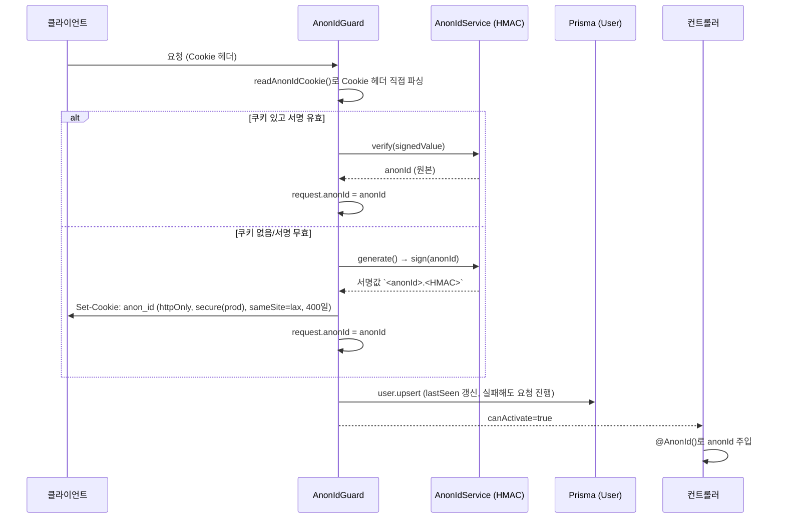
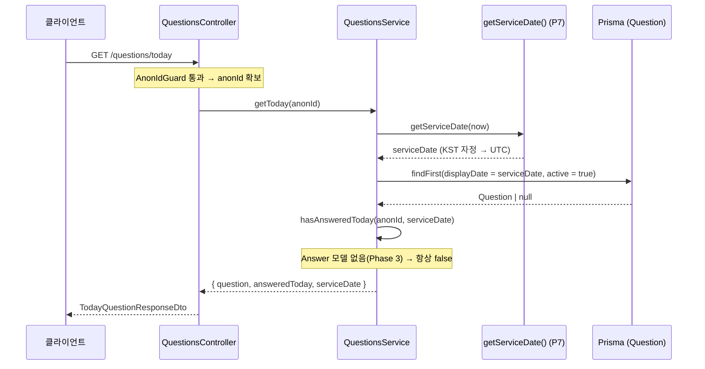
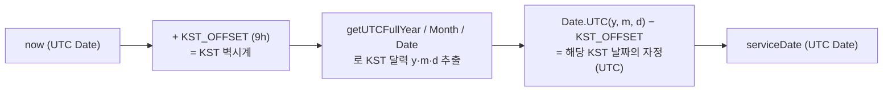
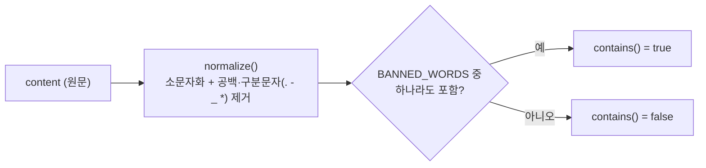

# 하루 하나 (haru-hana) — 백엔드

매일 질문 1개에 답하고 감성 카드를 만드는 **무로그인·익명** 서비스의 백엔드.
개발 규칙은 [`.claude/CLAUDE.md`](.claude/CLAUDE.md), 기획은 `docs/PRD_데일리카드.md`(정책 번호 P1~P7)를 따른다.

- **스택**: NestJS 11 · TypeScript · Prisma + PostgreSQL · Jest
- **배포**: Vercel 서버리스 함수 + Neon(pooled Postgres)

## 실행

```bash
npm install

# 로컬 개발 (src/main.ts, app.listen)
npm run start:dev

# 테스트
npm run test        # 단위
npm run test:e2e    # e2e
npm run test:cov    # 커버리지
```

- 로컬 개발: `src/main.ts` — 포트를 열고 Swagger 문서(`/api`)를 제공한다.
- 서버리스 배포: `api/index.ts` — 포트를 열지 않고 `app.init()`한 Express 인스턴스를 함수 핸들러로 노출한다(Swagger 제외).
- 두 진입점의 미들웨어·파이프(Helmet · CORS · ValidationPipe) 설정은 항상 동일하게 유지한다.

---

## 아키텍처 개요

```
api/index.ts        # 서버리스 진입점 (Vercel)
src/
├─ main.ts          # 로컬 진입점 (Helmet · CORS · ValidationPipe · Swagger)
├─ app.module.ts    # 루트 모듈
├─ config/          # env.validation.ts (Zod, fail-fast)
├─ common/
│  ├─ prisma/       # PrismaService (전역)
│  ├─ identity/     # 익명 식별자 (P2)
│  ├─ date/         # serviceDate 유틸 (P7)
│  └─ moderation/   # 금칙어 필터 (P6)
└─ modules/
   └─ questions/    # 오늘의 질문 (P3)
prisma/schema.prisma  # User · Question 모델
```

구현 현황: **questions 모듈 + 공통(identity/date/moderation)까지 구현됨.** `answers` 모듈과 `Answer` 모델은 Phase 3 예정이라 아직 없다.

---

## 도메인별 흐름도

### 1. 익명 식별자 — P2 (`common/identity`)

로그인이 없으므로 **서명된 httpOnly 쿠키 하나**로 사용자를 식별한다. `AnonIdGuard`가 붙은 모든 라우트에서 요청마다 실행되어 `request.anonId`를 보장하고, 컨트롤러는 `@AnonId()` 데코레이터로 그 값을 받는다.

서명/검증은 `AnonIdService`가 `COOKIE_SECRET` 기반 **HMAC-SHA256**으로 직접 처리한다(cookie-parser 비의존 → 로컬·서버리스 동일 동작).



- 쿠키 값 형식: `<anonId>.<base64url HMAC>`. 검증은 `timingSafeEqual`로 타이밍 공격을 방지한다.
- `touchUser()`의 `user.upsert`는 리텐션 지표(D1/D7)용 `lastSeen` 갱신이며, 비핵심이라 실패해도 요청을 막지 않는다.
- 가드는 인가(차단)가 아니라 "식별자 보장"이 목적이므로 항상 `true`를 반환한다.

### 2. 오늘의 질문 — P3 (`modules/questions`)

`GET /questions/today` 하나로 **오늘의 질문 + 본인 답변 여부 + serviceDate**를 함께 내려준다. `AnonIdGuard`가 컨트롤러 전체에 적용된다.



응답 DTO (`TodayQuestionResponseDto`):

| 필드 | 설명 |
|---|---|
| `question` | 오늘 매칭 질문 `{ id, body }`. 운영자 미등록일이면 `null` |
| `answeredToday` | 본인이 오늘 이미 답변했는지 (P1, 완료 모달 분기용). **현재 항상 false** |
| `serviceDate` | KST 자정 기준 서비스 날짜 (UTC ISO-8601) |

- 질문은 순환 로직이 아니라 `displayDate`(serviceDate 매칭 키)로 **DB에서 조회**한다.
- `hasAnsweredToday`는 `Answer` 모델 추가(Phase 3) 전까지 `false`를 반환하는 스텁이다.

### 3. 서비스 날짜 — P7 (`common/date/service-date.util`)

하루 1회 판정(P1)·질문 전환(P3)의 일관성을 위해, "서비스 날짜"는 사용자 로컬 시간과 무관하게 **KST(UTC+9) 자정**을 기준으로 계산한다. 모든 도메인은 이 단일 함수(`getServiceDate`)만 사용한다.



- 예) KST 2026-06-19 00:00 → 반환 `UTC 2026-06-18 15:00`. DB에는 UTC로 저장되며 `Question.displayDate` 매칭 키로 쓰인다.
- Vercel 함수는 UTC로 실행되므로 로컬 타임존 게터(`getHours`/`getFullYear` 등)를 쓰지 않고 `getUTC*`·`Date.UTC`만 사용한다(진입점·런타임 무관 불변식).

### 4. 금칙어 필터 — P6 (`common/moderation/profanity.service`)

답변 제출 시 서버에서 콘텐츠를 검사해 어뷰징·유해물을 차단하기 위한 공용 서비스. **"검사"만 책임진다** — 차단 시 어떤 HTTP 응답을 줄지는 호출하는 도메인 서비스(answers, Phase 3)가 결정한다.



- 정규화로 `ㅅ ㅂ`, `f.u.c.k` 류의 단순 우회를 완화한다. 금칙어 목록은 최소 기본값이며 운영 중 보강한다.
- 아직 이 서비스를 호출하는 엔드포인트는 없다(`answers` 제출 흐름이 Phase 3에서 연결됨).

---

## 데이터 모델 (`prisma/schema.prisma`)

| 모델 | 용도 | 핵심 필드 |
|---|---|---|
| `User` | 익명 사용자, 리텐션 지표(D1/D7) | `anonId`(PK, P2) · `firstSeen` · `lastSeen`(@updatedAt) |
| `Question` | 오늘의 질문 (P3) | `body` · `displayDate`(@unique, serviceDate 매칭 키) · `active` |

> `Answer` 모델(P1 `@@unique([anonId, serviceDate])`, P5 타인 답변)은 Phase 3에서 마이그레이션으로 추가한다.

- 런타임 연결은 `DATABASE_URL`(pooled/PgBouncer), 마이그레이션은 `DIRECT_URL`(non-pooled)을 쓴다.
- `binaryTargets`에 `native`(로컬)와 `rhel-openssl-3.0.x`(Vercel 런타임)를 함께 포함한다.

## 환경변수

`config/env.validation.ts`가 Zod로 검증하며 누락/오류 시 **즉시 종료(fail-fast)**한다.

| 변수 | 용도 |
|---|---|
| `DATABASE_URL` | 런타임 DB 연결(pooled) |
| `DIRECT_URL` | 마이그레이션용 직접 연결 |
| `COOKIE_SECRET` | anonId 쿠키 HMAC 서명 키 (P2) |
| `CORS_ORIGINS` | CORS 허용 오리진 화이트리스트 |
| `NODE_ENV` | 쿠키 `secure` 분기 등 |
| `PORT` | 로컬 개발 포트 |
